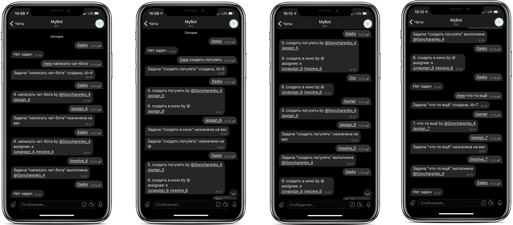

## Реализация телеграм-бота по управлению задачами

### Управление происходит через текстовый интерфейс:
- `/tasks`
- `/new XXX YYY ZZZ` - создаёт новую задачу
- `/assign_$ID` - делает пользователя исполнителем задачи
- `/unassign_$ID` - снимает задачу с текущего исполнителя
- `/resolve_$ID` - выполняет задачу, удаляет её из списка
- `/my` - показывает задачи, которые назначены на меня
- `/owner` - показывает задачи которые были созданы мной

Использование подправленной библиотеки для работы с телеграм-ботом, чтобы можно было написать тесты притворившись сервером телеграма. Она лежит в папке vendors . 
Тесты запускаются через `go test -v -mod=vendor`.

Запуск чат-бота возможен в 2-х вариантах:
1. `ngrok` (https://ngrok.com/) - пробрасывает порт к вам (после авторизации там будет команда для сохранения токена в конфиге). Скорее всего не будет работать из-за Роскомнадзора.
2. `heroku` (https://devcenter.heroku.com/articles/getting-started-with-go) - предоставляют бесплатный хостинг для Golang с поддоменом и сертификатом, который можно подключить к телеграму. 
