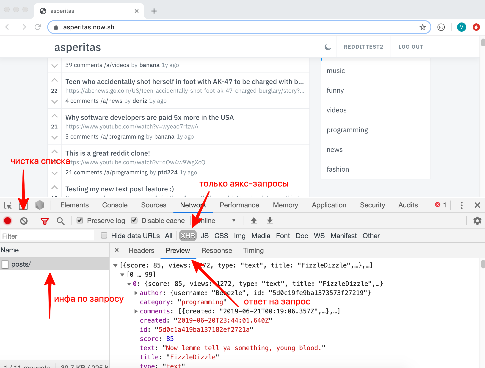

 ## Написание веб-сервера с базой данных

Имеется ресурс - https://www.reddit.com/

- https://asperitas.now.sh/ - веб-версия клона reddit
- https://github.com/d11z/asperitas - все исходники (все на JS)

Фронтенд полностью работает на JS  
Отправка нужной статики: html, который подключает весь JS, а последний делает AJAX-запросы к беку.  
Все API отдают данные в формате JSON  
Данные хранятся в памяти, везде есть мютексы.  
Реализована полная работоспоосбность всего функционала при запуске приложения.  
Корректная работа от разных пользователей  
Отсутствие глобальных переменных.  
Фронтенд - часть находится в папке redditclone/template, index.html надо отдать go-шным сервисом корне ( / ), js и css - как статику, тоже go-шным кодом.  
Сессии используюся через JWT, https://jwt.io/ - возвращаем ровно то же самое. Cookie для сессий тут не используем! Делаем через JWT.

У нас имеются следующие API-методы:
1) `POST /api/register` - регистрация
2) `POST /api/login` - логин
3) `GET /api/posts/` - список всех постов
4) `POST /api/posts/` - добавление поста - обратите внимание - есть с урлом, а есть с текстом
5) `GET /a/funny/{CATEGORY_NAME}` - список постов конкретной категории
6) `GET /api/post/{POST_ID}` - детали поста с комментами
7) `POST /api/post/{POST_ID}` - добавление коммента
8) `DELETE /api/post/{POST_ID}/{COMMENT_ID}` - удаление коммента
9) `GET /api/post/{POST_ID}/upvote` - рейтинг поста вверх
10) `GET /api/post/{POST_ID}/downvote` - рейтинг поста вниз
11) `DELETE /api/post/{POST_ID}` - удаление поста
12) `GET /api/user/{USER_LOGIN}` - получение всех постов конкртеного пользователя

Внутри имеются следующие сущности:
1) Пользователь
2) Сессия ( получается при авторизации )
3) Пост
4) Коммент к посту

Как смотреть в каком формате фронтенд ожидает ответ от API:
1) Открыть сайт https://asperitas.now.sh/
2) Открыть консоль ( в Chrome - F12 )
3) Выбрать секцию Network
4) Выбрать XHR - это покажет только аякс-запросы
5) Кликнуть на запрос
6) В секции Headers->Request Headers при постинге коммента можно найти заголовок authorization - так клиент отправляет авторизацию
7) В секции Preview можно найти ответ

Смотрим ответ, пишем код, который будет отдавать точно такой же ответ.
